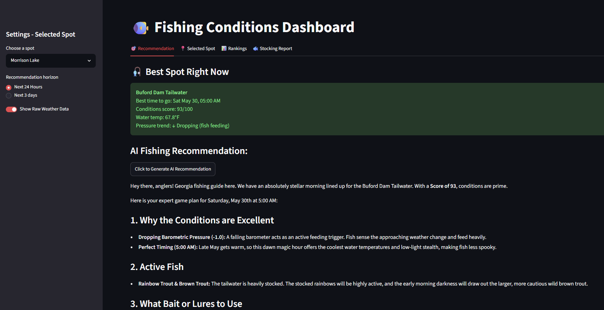
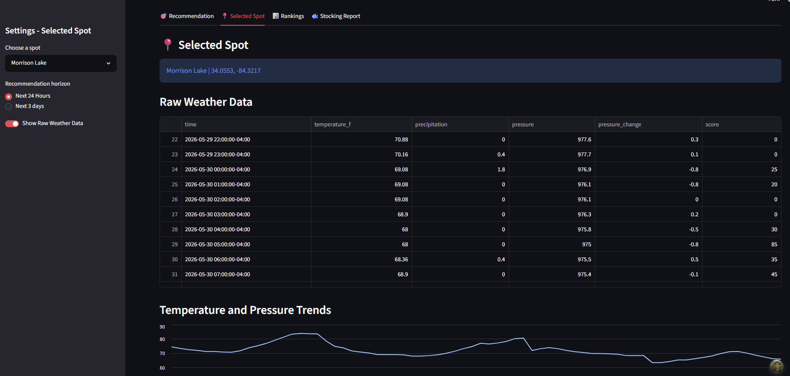
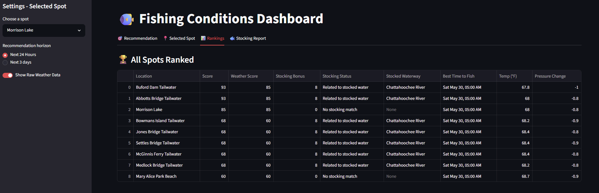
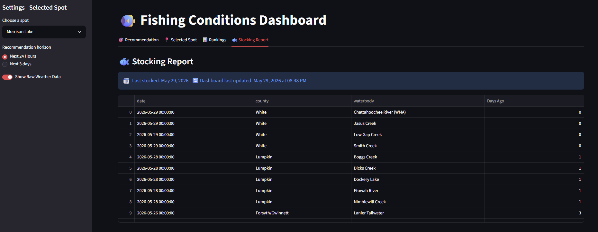

# Fishing Recommendation Dashboard
- A Streamlit dashboard that combines live weather data, barometric pressure trends, and Georgia DNR trout stocking reports to recommend the best fishing spots and times in North Georgia. An AI fishing guide powered by Gemini LLM explains conditions in plain English.

**Live app:** [https://fishing-ga.streamlit.app/](https://fishing-ga.streamlit.app/)

---
## Dashboard screenshot:

---

## How it works
1. **Data ingestion** - Live hourly weather data is fetched from the Open-Meteo API for each fishing location. The Georgia DNR weekly trout stocking report is automatically parsed from a government PDF using pdfplumber.
2. **Scoring** - Each hour is scored 0–100 based on water temperature (ideal trout range: 52–64°F), barometric pressure trend (dropping pressure = active feeding), time of day (dawn/dusk windows), and precipitation.
3. **Ranking** - All spots are ranked by their best scoring hour in the next 24 hours. Spots on recently stocked waterways receive a bonus.
4. **AI Recommendation** - Scored data is passed to the Gemini LLM which generates a plain-English fishing recommendation including suggested techniques and target species.

## Features
- Live weather data from Open Meteo API: https://open-meteo.com/
- Automated PDF parsing of Georgia DNR weekly stocking reports
- Custom Scoring Model based on optimal fishing conditions
- Spot ranker comparing all locations based on temperature, pressure, and stocking data
- AI-powered recommendations via Gemini LLM API
- Interactive weather charts for selected spots

## Tech Stack
- Python
- Streamlit
- pandas
- Open-Meteo API
- pdfplumber
- Gemini LLM (integrated LLM for recommendations via REST API)
- altair
- pytz 

## How to run locally
```bash
# Clone the repo
git clone https://github.com/sohankyatham/fishing-recommendation-dashboard

# Install dependencies
pip install -r requirements.txt

# Add your Gemini API key
# Create a .env file with:
# GEMINI_API_KEY=your_key_here

# Run the app
streamlit run app.py
```

## Data Sources
- **Weather:** [Open-Meteo](https://open-meteo.com/) 
- **Stocking Reports:** [Georgia DNR Wildlife Resources Division](https://georgiawildlife.com/fishing-forecasts)

## Screenshots of app






## What I Learned & Improved
**New skills:**
- Deployment - deploying the live app on Streamlit Cloud with secrets management
- PDF parsing - extracted structured data from government PDF using pdfplumber

**Improved skills:**
- LLM Integration - passing structured data to Gemini & prompt engineering for useful output
- API Integration - caching, error handling, & timeout management
- pandas - derived columns, filtering, multi-DataFrame operations
- Streamlit - multi-tab layouts, session state, cahcing with ttl